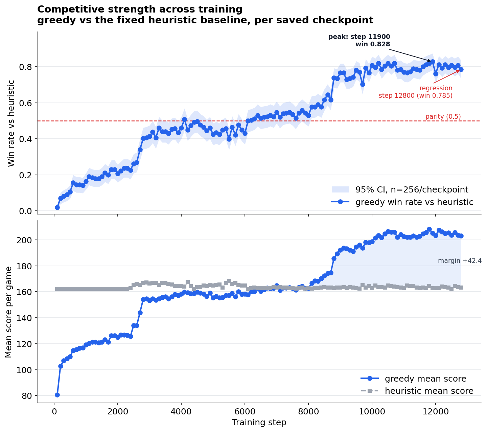
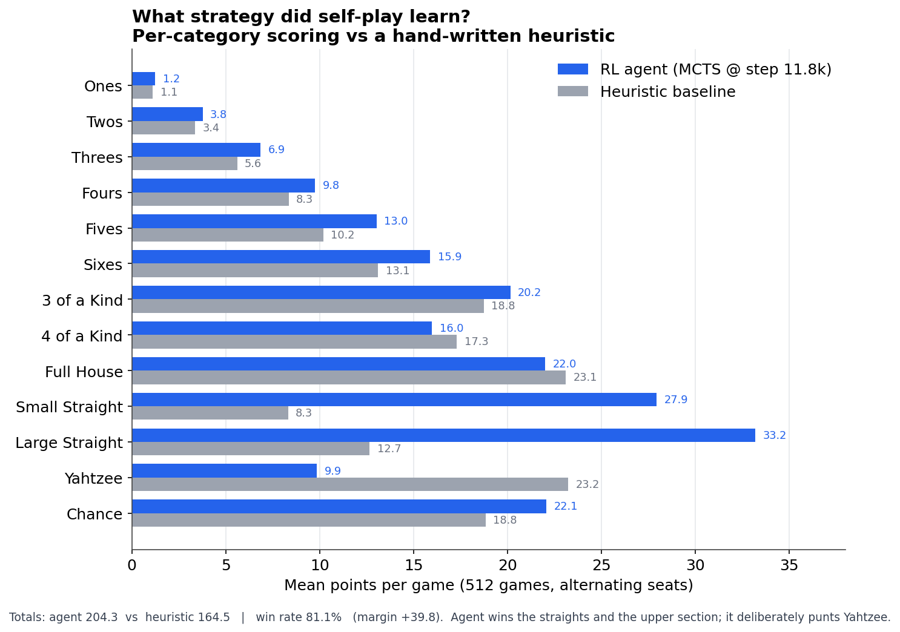
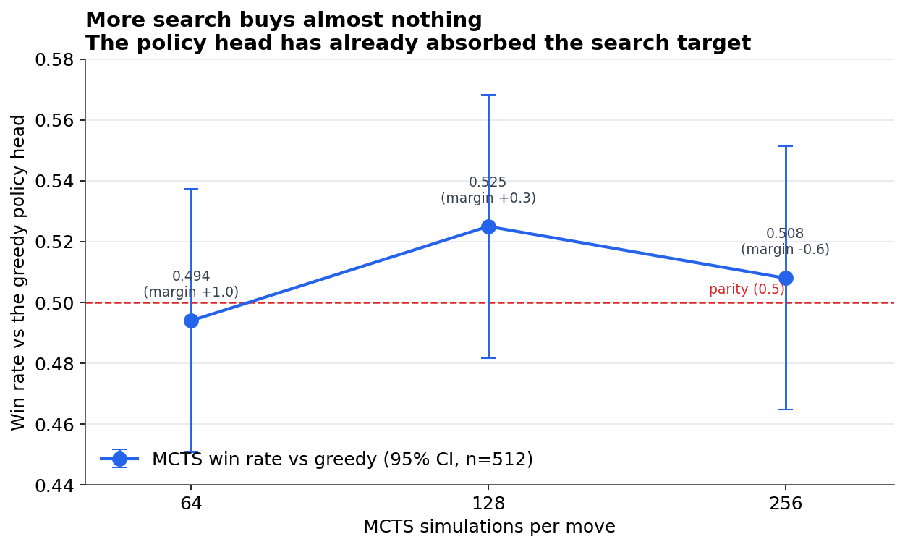

# YahtzeeRL

[](https://github.com/itxtx/yahtzeeRL/actions/workflows/ci.yml)

JAX/Flax/RLax Yahtzee self-play experiments with MCTS.

The current implementation targets two-player head-to-head self-play using
simplified standard Yahtzee scoring: 13 categories plus upper bonus, without
Joker rules or extra Yahtzee bonuses.

The search uses Stochastic MuZero (`mctx.stochastic_muzero_policy`) with
explicit decision and chance nodes: actions resolve to afterstates, and the
pending dice reroll is a chance node over the 252 sorted 5-dice hands with its
exact multinomial distribution computed analytically. Dice are kept sorted in
the environment (game-equivalent), so permutation-equivalent states collapse.
Training samples minibatches from a replay buffer of recent self-play frames
and regresses values onto a blend of the terminal outcome and the search root
value (`--value-target-outcome-weight`). Evaluation and CLI play run the search
without Dirichlet noise and act greedily on visit counts.

Because this is a two-player game, the search uses a **negamax** value
convention threaded through the chance node. `mctx` hardcodes reward 0 and
discount +1 on decision→afterstate edges, so an afterstate value is read from
the acting player's perspective. The perspective flip happens on the
chance→state edge, where the reroll resolves: the discount is `-1` when scoring
passed the turn to the opponent, `+1` when the same player continues after a
hold, and `0` into a terminal state (with the terminal reward delivered on that
edge, from the acting player's perspective). Getting this sign handling right is
what lets a single value head serve both seats.

## Project Status

The first project goal was to train a competitive head-to-head agent that
reliably beats the hand-written heuristic baseline. That goal is achieved. In
the current experiments, `win_loss_margin_32simsrun4/step_011800` is the best
competitive checkpoint to preserve:

```text
mcts@step_11800 vs heuristic, 512 games:
  win rate 0.811, mean score 204.28, margin +39.80

greedy@step_11800 vs greedy@step_12800, 512 games:
  step_11800 win rate 0.553, margin +7.13
```

Continuing the same win/loss-margin training after this point produced
regressions and very small, noisy gains, so further work should not be framed as
Kaggle-style hyperparameter chasing on the same objective.

See [EVAL_RESULTS.md](EVAL_RESULTS.md) for the collected checkpoint comparison
logs. The per-category and search figures below are generated by
[`plots/make_plots.py`](plots/make_plots.py); the training curve is generated by
[`scripts/eval_checkpoint_curve.py`](scripts/eval_checkpoint_curve.py) from
[`plots/winrate_vs_step.csv`](plots/winrate_vs_step.csv).

### Competitive strength across training



Win rate of the greedy policy head against the fixed heuristic, evaluated at
every saved checkpoint (256 games each, alternating seats). Search is omitted
here on purpose: as the next figure shows, MCTS and the greedy head are at
parity, so greedy is a faithful and far cheaper proxy for the training curve.
The agent crosses parity around step ~6k, climbs into the low-0.8s, and peaks
near step 11.8k–11.9k before a mild regression — the empirical reason to
preserve `step_011800` rather than treat later checkpoints as the new default.

The flat ~164 baseline line is not a weak opponent: the heuristic itself beats a
uniform-random policy 100% of the time (mean 164 vs 46), so the skill ladder is
random ~46 → heuristic ~164 → agent ~204, and the 81% win rate is over a
genuinely strong baseline. See [EVAL_RESULTS.md](EVAL_RESULTS.md#baseline-calibration).

Regenerate it without re-running the sweep:

```bash
python scripts/eval_checkpoint_curve.py --plot-only --csv plots/winrate_vs_step.csv
```

### What strategy did self-play learn?



Against the hand-written heuristic the agent wins the full upper section (so it
reliably banks the upper bonus) and dominates both straights, while
*deliberately* punting Yahtzee (9.9 vs 23.2). That trade is the interesting part:
the learned policy spends its dice on the categories that win head-to-head games
rather than on the highest single-category jackpot.

### Does more search help?



Run against its own greedy policy head, MCTS sits on parity at every search
budget — all three 95% confidence intervals straddle 0.5. The policy head has
already absorbed the useful shallow/medium search target, so spending more
simulations buys essentially nothing at evaluation time.

The next distinct research direction is a score-maximizing Yahtzee agent. That
should be treated as a new objective, not a continuation of the competitive
head-to-head run. A plausible target is to optimize final own score directly,
for example with a bounded terminal reward such as:

```text
tanh((own_score - 200) / 50)
```

Evaluate that direction with greedy mean score over at least 1k games. Useful
milestones would be 215, 225, and 235+ average score, with 240-250 as a stretch
range if the score-max objective learns a higher-variance style.

## Pretrained Checkpoint

The best competitive checkpoint is available on
[Hugging Face](https://huggingface.co/itxtx/yahtzee-rl-checkpoints):

```bash
hf download itxtx/yahtzee-rl-checkpoints \
  --local-dir checkpoints/win_loss_margin_32simsrun4
```

Checkpoint compatibility is tied to the model architecture and the code's
checkpoint format. The published checkpoints use `hidden_dim=256` and can be
resumed or evaluated while changing runtime knobs such as `--num-simulations`,
`--batch-size`, replay size, and minibatch settings. They are not compatible
with architecture changes such as a different `--hidden-dim`, and are best used
with the dependency versions from this repository.

Evaluate it against the heuristic baseline:

```bash
python -m yahtzee_rl.evaluate \
  --agent-a mcts \
  --checkpoint-a checkpoints/win_loss_margin_32simsrun4/step_011800 \
  --agent-b heuristic \
  --num-games 512 \
  --sims-a 32
```

## Install / Quickstart

`uv` is the recommended and CI-tested path — it installs the exact, known-good
versions from `uv.lock` (including `mctx>=0.0.6`, which the search code requires):

```bash
git clone https://github.com/itxtx/yahtzeeRL.git
cd yahtzeeRL
uv sync --extra dev
```

`pip` also works and resolves the same dependencies from `pyproject.toml`:

```bash
git clone https://github.com/itxtx/yahtzeeRL.git
cd yahtzeeRL
python -m venv .venv
source .venv/bin/activate
pip install -e '.[dev]'   # equivalently: pip install -r requirements.txt
```

Requires Python >= 3.11. All dependencies are declared in `pyproject.toml`;
`requirements.txt` just redirects pip there so the two never drift.

## Local CPU Smoke Tests

```bash
uv run pytest
uv run python -m yahtzee_rl.evaluate --batch-size 16
```

## Training

Local Apple Silicon JAX runs on CPU, so use small settings locally:

```bash
python -m yahtzee_rl.train --steps 2 --batch-size 2 --num-simulations 2
```

Training defaults to margin-shaped terminal rewards:

```text
sign(score_margin) * (1 - 0.25) + 0.25 * tanh(score_margin / 50)
```

This stays within `[-1, 1]` to match the tanh-bounded value head, splitting the
unit reward between a win/loss baseline and a margin-sensitive term.

Use pure win/loss targets for comparison:

```bash
python -m yahtzee_rl.train --reward-mode win_loss
```

Resume from a checkpoint (restores params + optimizer state, continues global
step numbering, runs `--steps` additional updates; hyperparameters like
`--num-simulations` may change between runs, `--hidden-dim` must match):

```bash
python -m yahtzee_rl.train \
  --resume checkpoints/colab_run \
  --checkpoint-dir checkpoints/colab_run \
  --steps 4000 \
  --num-simulations 64
```

Replay and value-target knobs (defaults shown):

```bash
python -m yahtzee_rl.train \
  --buffer-size 100000 \
  --minibatches-per-update 4 \
  --minibatch-size 1024 \
  --value-target-outcome-weight 0.5
```

Late-training teacher updates can periodically spend more search on a smaller
self-play batch while keeping most updates cheaper:

```bash
python -m yahtzee_rl.train \
  --resume checkpoints/colab_run \
  --checkpoint-dir checkpoints/colab_run \
  --steps 1000 \
  --batch-size 48 \
  --num-simulations 172 \
  --minibatches-per-update 2 \
  --teacher-every 5 \
  --teacher-batch-size 32 \
  --teacher-num-simulations 256 \
  --teacher-minibatches-per-update 4
```

For GPU training, copy this repo to Google Drive and run:

```text
notebooks/colab_self_play.ipynb
```

The notebook mounts Drive, installs the repo, verifies `jax.devices()`, and
copies the repo to `/content/yahtzeeRL` for faster Colab execution while writing
checkpoints back to Drive.

The Colab notebook runs full training/evaluation through `python -m ...`
subprocesses instead of `train(config)` inside the notebook kernel. This avoids
keeping JAX's GPU allocator pool and compiled programs alive after training
finishes.

## Play Against The Agent

```bash
python -m yahtzee_rl.play_cli --checkpoint checkpoints/colab_run --num-simulations 32
python -m yahtzee_rl.play_cli --checkpoint checkpoints/colab_run --debug-agent --top-k 5
```

During your turn, choose reroll actions as `h00` through `h31` or score actions
as `s00` through `s12`. The CLI prints the legal actions each turn.

## Evaluate Agents

```bash
python -m yahtzee_rl.evaluate --agent-a mcts --checkpoint-a checkpoints/colab_run --agent-b heuristic --num-games 256 --sims-a 32
python -m yahtzee_rl.evaluate --agent-a mcts --checkpoint-a checkpoints/run_a --agent-b mcts --checkpoint-b checkpoints/run_b --num-games 256
python -m yahtzee_rl.evaluate --num-games 16
```

The evaluator alternates seats so first-player effects do not dominate the
reported win rate, score margin, and optional per-category means.
